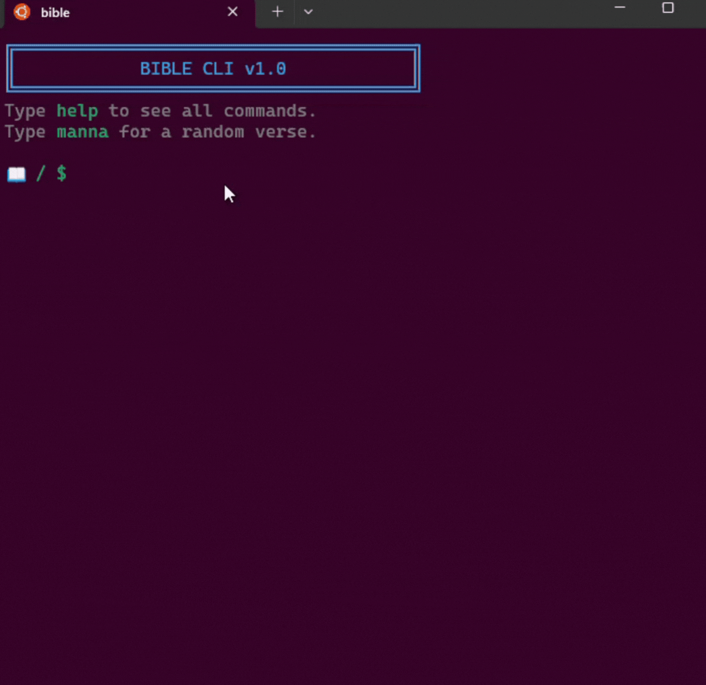

# Bible CLI 📖


<p align="center">
  
</p>

**Bible CLI** is a fast, interactive, and modular command-line interface for reading and searching the Bible. Built with Go, it offers a Unix-like shell experience (`cd`, `cat`, `ls`, `grep`) to navigate Scripture directly from your terminal.

-----

## 🚀 Features

  * **Unix-Style Navigation:** Move through Testaments, Books, and Chapters using `cd` and `ls`.
  * **Smart Reading:** Read single verses, ranges (`3:16-18`), or non-sequential verses (`3:16,18`).
  * **Multi-Reference Support:** Read from different books simultaneously (e.g., `cat John 3:16 + Gen 1:1`).
  * **Context-Aware Search:** Use `grep` to search the entire Bible, a specific Testament, or just the current Book.
  * **Bookmarks:** Save your place with `mark` and return instantly with `goto`.
  * **Zero Latency:** The entire database is embedded into the binary for instant access without internet.

-----

## 📦 Installation

### Prerequisites

  * [Go 1.25+](https://go.dev/dl/) installed on your machine.

### Build from Source

```bash
# 1. Clone the repository
git clone https://github.com/EcclesiaTechStudio/bible-cli.git

# 2. Navigate to the directory
cd bible-cli

# 3. Build the binary
go build -o bible main.go

# 4. Run it
./bible
```

### Install Globally

To use the `bible` command anywhere in your terminal:

```bash
go install github.com/EcclesiaTechStudio/bible-cli@latest
```

-----

## 🎮 Usage Guide

Once inside the shell, you will see a prompt indicating your current location (e.g., `/NT/John`).

### 1\. Navigation (`cd`, `ls`)

| Command | Description | Example |
| :--- | :--- | :--- |
| `ls` | List books or chapters in current location | `ls` |
| `cd <book>` | Enter a book (fuzzy matching supported) | `cd john`, `cd 1 cor` |
| `cd <chapter>` | Enter a chapter | `cd 3` |
| `cd ..` | Go up one level | `cd ..` |
| `cd /` | Return to root | `cd /` |
| `cd -` | Go to previous location (Undo) | `cd -` |

### 2\. Reading (`cat`)

| Command | Description | Example |
| :--- | :--- | :--- |
| `cat` | Read current chapter (if inside one) | `cat` |
| `cat <ref>` | Read specific verses | `cat 3:16`, `cat 3:16-18` |
| `cat <book> <ref>` | Quick read without moving | `cat ps 23`, `cat rom 8:28` |
| `cat ... + ...` | Read multiple references | `cat gen 1:1 + jn 1:1` |

### 3\. Search (`grep`)

The search scope depends on where you are in the directory structure:

  * **Root (`/`):** Searches the entire Bible.
  * **Testament (`/OT`):** Searches only the Old Testament.
  * **Book (`/OT/Genesis`):** Searches only Genesis.

<!-- end list -->

```bash
# Search for "light" in the current context
grep light
```

### 4\. Bookmarks & Tools

| Command | Description |
| :--- | :--- |
| `mark <name>` | Save current location as a bookmark. |
| `goto <name>` | Jump to a saved bookmark. |
| `marks` | List all saved bookmarks. |
| `manna` | Display a completely random verse. |
| `clear` | Clear the terminal screen. |

-----

## 🏗️ Project Architecture

This project follows a clean, modular architecture (Separation of Concerns):

```text
bible-cli/
├── main.go                # Entry point
├── data.json              # Embedded Scripture Database
└── internal/
    ├── model/             # Data Structures & JSON Parsing
    ├── shell/             # Core Engine, State & Logic
    ├── ui/                # Formatting, Colors & Output
    └── testutils/         # Testing helpers (Stdout capture)
```

  * **Internal/Model:** Handles strict typing for the Bible structure.
  * **Internal/Shell:** Manages the state machine (Path, History, Bookmarks) and command routing.
  * **Internal/UI:** Handles ANSI color codes and pretty-printing.

-----

## 🧪 Testing

The project includes a robust test suite covering navigation logic, string parsing, and scope validation.

To run all tests:

```bash
go test -v -cover ./...
```

-----

## 🤝 Contributing

Contributions are welcome\!

1.  Fork the Project
2.  Create your Feature Branch (`git checkout -b feature/AmazingFeature`)
3.  Commit your Changes (`git commit -m 'Add some AmazingFeature'`)
4.  Push to the Branch (`git push origin feature/AmazingFeature`)
5.  Open a Pull Request

-----

## 📄 License

Distributed under the MIT License. See `LICENSE` for more information.

-----

> **Ecclesia Tech Studio** — *Intentional Tech for the Church.*
